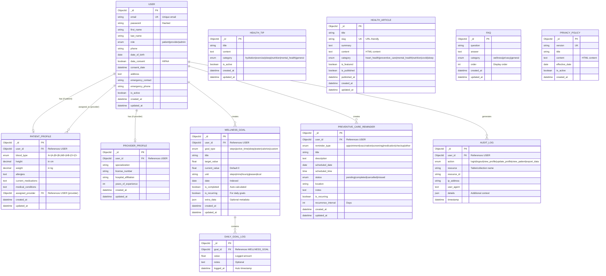
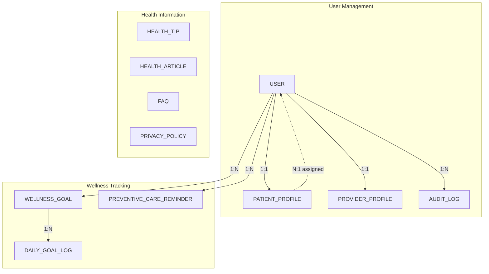
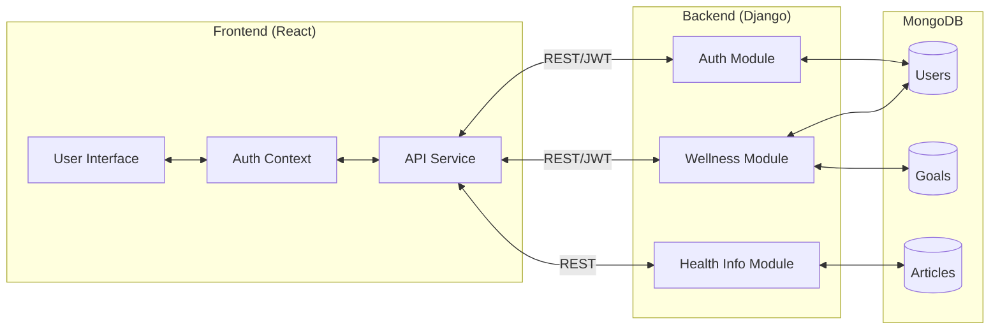

# Healthcare Portal - Entity Relationship Diagram

## Visual ER Diagram (Mermaid)

---

## Simplified Relationship View

---

## Data Flow Diagram

---

## Table Relationships Summary

| Parent Table | Child Table | Relationship | Foreign Key |
|-------------|-------------|--------------|-------------|
| USER | PATIENT_PROFILE | 1:1 | user_id |
| USER | PROVIDER_PROFILE | 1:1 | user_id |
| USER | WELLNESS_GOAL | 1:N | user_id |
| USER | PREVENTIVE_CARE_REMINDER | 1:N | user_id |
| USER | AUDIT_LOG | 1:N | user_id |
| WELLNESS_GOAL | DAILY_GOAL_LOG | 1:N | goal_id |
| USER (provider) | PATIENT_PROFILE | 1:N | assigned_provider |

---

## Cardinality Notation

- `||--o|` : One to Zero or One
- `||--o{` : One to Zero or Many
- `}o--||` : Many to One (with optional)
- `||--|{` : One to One or Many

---

## How to View This Diagram

1. **GitHub/GitLab**: These platforms render Mermaid diagrams automatically
2. **VS Code**: Install "Markdown Preview Mermaid Support" extension
3. **Online**: Use [Mermaid Live Editor](https://mermaid.live/)
4. **Notion**: Paste Mermaid code in a code block with `mermaid` language

---

*Generated for Healthcare Wellness Portal*

