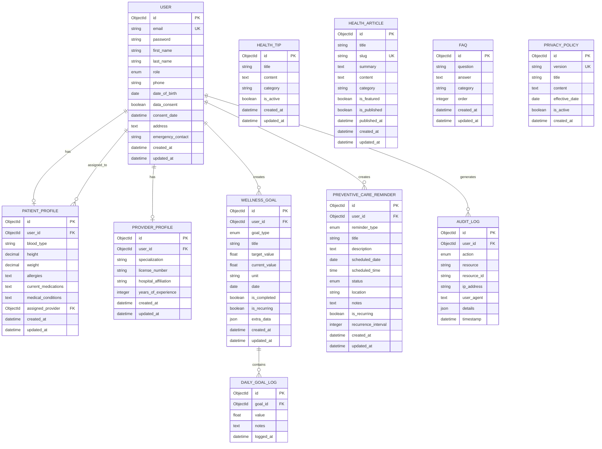

# Healthcare Wellness Portal - Low Level Design (LLD)

## Table of Contents
1. [System Overview](#1-system-overview)
2. [Architecture Design](#2-architecture-design)
3. [Database Design & ER Diagram](#3-database-design--er-diagram)
4. [API Design](#4-api-design)
5. [Component Design](#5-component-design)
6. [Data Flow Diagrams](#6-data-flow-diagrams)
7. [Security Design](#7-security-design)

---

## 1. System Overview

### 1.1 Purpose
The Healthcare Wellness and Preventive Care Portal is a web application designed to help patients track wellness goals, manage preventive care reminders, and connect with healthcare providers.

### 1.2 Key Features
- User Authentication (JWT-based)
- Patient Dashboard with Wellness Goals
- Preventive Care Reminders
- Healthcare Provider Dashboard
- Health Information & Articles
- Profile Management
- HIPAA Compliance Logging

### 1.3 Technology Stack
| Layer | Technology |
|-------|------------|
| Frontend | React.js + Vite |
| Backend | Django + Django REST Framework |
| Database | MongoDB (via Djongo) |
| Authentication | JWT (SimpleJWT) |
| Deployment | Cloud Platform |

---

## 2. Architecture Design

### 2.1 High-Level Architecture

```
┌─────────────────────────────────────────────────────────────────┐
│                         CLIENT LAYER                             │
│  ┌─────────────────────────────────────────────────────────┐    │
│  │                    React Frontend                        │    │
│  │  ┌──────────┐ ┌──────────┐ ┌──────────┐ ┌──────────┐   │    │
│  │  │  Pages   │ │Components│ │ Context  │ │ Services │   │    │
│  │  └──────────┘ └──────────┘ └──────────┘ └──────────┘   │    │
│  └─────────────────────────────────────────────────────────┘    │
└─────────────────────────────────────────────────────────────────┘
                              │
                              │ HTTPS/REST API
                              ▼
┌─────────────────────────────────────────────────────────────────┐
│                         API LAYER                                │
│  ┌─────────────────────────────────────────────────────────┐    │
│  │              Django REST Framework                       │    │
│  │  ┌──────────┐ ┌──────────┐ ┌──────────┐ ┌──────────┐   │    │
│  │  │  Views   │ │Serializers│ │  Auth   │ │Middleware│   │    │
│  │  └──────────┘ └──────────┘ └──────────┘ └──────────┘   │    │
│  └─────────────────────────────────────────────────────────┘    │
└─────────────────────────────────────────────────────────────────┘
                              │
                              │ ORM (Djongo)
                              ▼
┌─────────────────────────────────────────────────────────────────┐
│                       DATABASE LAYER                             │
│  ┌─────────────────────────────────────────────────────────┐    │
│  │                    MongoDB Atlas                         │    │
│  │  ┌──────────┐ ┌──────────┐ ┌──────────┐ ┌──────────┐   │    │
│  │  │  Users   │ │ Wellness │ │  Health  │ │  Audit   │   │    │
│  │  └──────────┘ └──────────┘ └──────────┘ └──────────┘   │    │
│  └─────────────────────────────────────────────────────────┘    │
└─────────────────────────────────────────────────────────────────┘
```

### 2.2 Module Structure

```
Backend/
├── core/                    # Project configuration
│   ├── settings.py         # Django settings
│   ├── urls.py             # Root URL configuration
│   └── wsgi.py             # WSGI entry point
│
├── accounts/               # User management module
│   ├── models.py          # User, Profile, AuditLog models
│   ├── views.py           # Auth & profile views
│   ├── serializers.py     # Data serialization
│   └── urls.py            # Auth endpoints
│
├── wellness/              # Wellness tracking module
│   ├── models.py          # Goals, Reminders, HealthTip
│   ├── views.py           # CRUD views for wellness
│   ├── serializers.py     # Wellness serializers
│   └── urls.py            # Wellness endpoints
│
└── health_info/           # Health information module
    ├── models.py          # Articles, FAQ, PrivacyPolicy
    ├── views.py           # Public health info views
    └── urls.py            # Health info endpoints
```

---

## 3. Database Design & ER Diagram

### 3.1 Entity Relationship Diagram

```
┌─────────────────────────────────────────────────────────────────────────────────┐
│                           ER DIAGRAM - Healthcare Portal                         │
└─────────────────────────────────────────────────────────────────────────────────┘

    ┌─────────────────┐         1:1          ┌─────────────────────┐
    │      USER       │◄────────────────────►│   PATIENT_PROFILE   │
    ├─────────────────┤                      ├─────────────────────┤
    │ PK: id          │                      │ PK: id              │
    │ email (unique)  │                      │ FK: user_id         │
    │ password (hash) │                      │ blood_type          │
    │ first_name      │                      │ height              │
    │ last_name       │                      │ weight              │
    │ role            │                      │ allergies           │
    │ phone           │                      │ current_medications │
    │ date_of_birth   │                      │ medical_conditions  │
    │ data_consent    │                      │ FK: assigned_provider│
    │ consent_date    │                      │ created_at          │
    │ address         │                      │ updated_at          │
    │ emergency_contact│                     └─────────────────────┘
    │ created_at      │
    │ updated_at      │         1:1          ┌─────────────────────┐
    └─────────────────┘◄────────────────────►│  PROVIDER_PROFILE   │
            │                                ├─────────────────────┤
            │                                │ PK: id              │
            │ 1:N                            │ FK: user_id         │
            │                                │ specialization      │
            ▼                                │ license_number      │
    ┌─────────────────┐                      │ hospital_affiliation│
    │   AUDIT_LOG     │                      │ years_of_experience │
    ├─────────────────┤                      │ created_at          │
    │ PK: id          │                      │ updated_at          │
    │ FK: user_id     │                      └─────────────────────┘
    │ action          │
    │ resource        │
    │ resource_id     │
    │ ip_address      │
    │ user_agent      │
    │ details (JSON)  │
    │ timestamp       │
    └─────────────────┘

            │
            │ 1:N
            ▼
    ┌─────────────────┐         1:N          ┌─────────────────────┐
    │  WELLNESS_GOAL  │◄────────────────────►│   DAILY_GOAL_LOG    │
    ├─────────────────┤                      ├─────────────────────┤
    │ PK: id          │                      │ PK: id              │
    │ FK: user_id     │                      │ FK: goal_id         │
    │ goal_type       │                      │ value               │
    │ title           │                      │ notes               │
    │ target_value    │                      │ logged_at           │
    │ current_value   │                      └─────────────────────┘
    │ unit            │
    │ date            │
    │ is_completed    │
    │ is_recurring    │
    │ extra_data(JSON)│
    │ created_at      │
    │ updated_at      │
    └─────────────────┘

            │
            │ (same user)
            │
            ▼
    ┌────────────────────────┐
    │ PREVENTIVE_CARE_REMINDER│
    ├────────────────────────┤
    │ PK: id                 │
    │ FK: user_id            │
    │ reminder_type          │
    │ title                  │
    │ description            │
    │ scheduled_date         │
    │ scheduled_time         │
    │ status                 │
    │ location               │
    │ notes                  │
    │ is_recurring           │
    │ recurrence_interval    │
    │ created_at             │
    │ updated_at             │
    └────────────────────────┘


    ┌─────────────────┐       ┌─────────────────┐       ┌─────────────────┐
    │   HEALTH_TIP    │       │ HEALTH_ARTICLE  │       │      FAQ        │
    ├─────────────────┤       ├─────────────────┤       ├─────────────────┤
    │ PK: id          │       │ PK: id          │       │ PK: id          │
    │ title           │       │ title           │       │ question        │
    │ content         │       │ slug (unique)   │       │ answer          │
    │ category        │       │ summary         │       │ category        │
    │ is_active       │       │ content         │       │ order           │
    │ created_at      │       │ category        │       │ created_at      │
    │ updated_at      │       │ is_featured     │       │ updated_at      │
    └─────────────────┘       │ is_published    │       └─────────────────┘
                              │ published_at    │
                              │ created_at      │       ┌─────────────────┐
                              │ updated_at      │       │ PRIVACY_POLICY  │
                              └─────────────────┘       ├─────────────────┤
                                                        │ PK: id          │
                                                        │ version         │
                                                        │ title           │
                                                        │ content         │
                                                        │ effective_date  │
                                                        │ is_active       │
                                                        │ created_at      │
                                                        └─────────────────┘
```

### 3.2 Detailed Schema Definitions

#### 3.2.1 User Model
```python
User {
    id: ObjectId (PK)
    email: String (unique, indexed)
    password: String (hashed)
    first_name: String
    last_name: String
    role: Enum ['patient', 'provider', 'admin']
    phone: String (nullable)
    date_of_birth: Date (nullable)
    data_consent: Boolean
    consent_date: DateTime (nullable)
    profile_picture: String (nullable)
    address: Text (nullable)
    emergency_contact: String (nullable)
    emergency_phone: String (nullable)
    is_active: Boolean
    is_staff: Boolean
    created_at: DateTime (auto)
    updated_at: DateTime (auto)
}
```

#### 3.2.2 WellnessGoal Model
```python
WellnessGoal {
    id: ObjectId (PK)
    user_id: ObjectId (FK -> User)
    goal_type: Enum ['steps', 'active_time', 'sleep', 'water', 'calories', 'custom']
    title: String (max 100)
    target_value: Float
    current_value: Float (default: 0)
    unit: String (max 20)
    date: Date (indexed)
    is_completed: Boolean (default: false)
    is_recurring: Boolean (default: false)
    extra_data: JSON (nullable)
    created_at: DateTime (auto)
    updated_at: DateTime (auto)
    
    UNIQUE CONSTRAINT: (user_id, goal_type, date)
}
```

#### 3.2.3 PreventiveCareReminder Model
```python
PreventiveCareReminder {
    id: ObjectId (PK)
    user_id: ObjectId (FK -> User)
    reminder_type: Enum ['appointment', 'vaccination', 'screening', 'medication', 'checkup', 'other']
    title: String (max 200)
    description: Text (nullable)
    scheduled_date: Date
    scheduled_time: Time (nullable)
    status: Enum ['pending', 'completed', 'cancelled', 'missed']
    location: String (nullable)
    notes: Text (nullable)
    is_recurring: Boolean (default: false)
    recurrence_interval: Integer (nullable, days)
    created_at: DateTime (auto)
    updated_at: DateTime (auto)
}
```

### 3.3 Relationships Summary

| Relationship | Type | Description |
|-------------|------|-------------|
| User → PatientProfile | 1:1 | Each patient has one profile |
| User → ProviderProfile | 1:1 | Each provider has one profile |
| User → WellnessGoal | 1:N | User can have many goals |
| User → PreventiveCareReminder | 1:N | User can have many reminders |
| User → AuditLog | 1:N | User actions are logged |
| WellnessGoal → DailyGoalLog | 1:N | Goal can have many log entries |
| PatientProfile → User (provider) | N:1 | Patient assigned to provider |

---

## 4. API Design

### 4.1 API Endpoints Overview

```
BASE URL: /api/v1/

AUTHENTICATION
├── POST   /auth/register/          # Register new user
├── POST   /auth/login/             # Login (get JWT tokens)
├── POST   /auth/logout/            # Logout
├── POST   /auth/token/refresh/     # Refresh access token
├── GET    /auth/profile/           # Get user profile
└── PATCH  /auth/profile/           # Update user profile

WELLNESS
├── GET    /wellness/dashboard/     # Dashboard summary
├── GET    /wellness/goals/         # List all goals
├── POST   /wellness/goals/         # Create new goal
├── GET    /wellness/goals/today/   # Get today's goals
├── GET    /wellness/goals/weekly/  # Weekly progress
├── GET    /wellness/goals/{id}/    # Get specific goal
├── PATCH  /wellness/goals/{id}/    # Update goal
├── DELETE /wellness/goals/{id}/    # Delete goal
├── POST   /wellness/goals/{id}/log/# Log progress
├── GET    /wellness/reminders/     # List reminders
├── POST   /wellness/reminders/     # Create reminder
├── GET    /wellness/reminders/upcoming/ # Upcoming reminders
├── PATCH  /wellness/reminders/{id}/# Update reminder
├── DELETE /wellness/reminders/{id}/# Delete reminder
└── GET    /wellness/health-tip/    # Get daily health tip

HEALTH INFO (Public)
├── GET    /health/articles/        # List articles
├── GET    /health/articles/{slug}/ # Get article
├── GET    /health/faqs/            # List FAQs
└── GET    /health/privacy/         # Get privacy policy

PROVIDER (Provider role only)
├── GET    /provider/patients/      # List assigned patients
└── GET    /provider/patients/{id}/ # Get patient details
```

### 4.2 API Request/Response Examples

#### 4.2.1 Register User
```http
POST /api/v1/auth/register/
Content-Type: application/json

Request:
{
    "email": "patient@example.com",
    "password": "SecurePass123!",
    "password_confirm": "SecurePass123!",
    "first_name": "John",
    "last_name": "Doe",
    "role": "patient",
    "data_consent": true
}

Response (201 Created):
{
    "id": "507f1f77bcf86cd799439011",
    "email": "patient@example.com",
    "first_name": "John",
    "last_name": "Doe",
    "role": "patient",
    "tokens": {
        "access": "eyJ0eXAiOiJKV1QiLCJhbGciOi...",
        "refresh": "eyJ0eXAiOiJKV1QiLCJhbGciOi..."
    }
}
```

#### 4.2.2 Create Wellness Goal
```http
POST /api/v1/wellness/goals/
Authorization: Bearer <access_token>
Content-Type: application/json

Request:
{
    "goal_type": "steps",
    "title": "Daily Steps",
    "target_value": 10000,
    "unit": "steps",
    "date": "2025-12-04",
    "is_recurring": true
}

Response (201 Created):
{
    "id": "507f1f77bcf86cd799439012",
    "goal_type": "steps",
    "title": "Daily Steps",
    "target_value": 10000,
    "current_value": 0,
    "unit": "steps",
    "date": "2025-12-04",
    "is_completed": false,
    "is_recurring": true,
    "progress_percentage": 0,
    "created_at": "2025-12-04T10:30:00Z"
}
```

#### 4.2.3 Log Goal Progress
```http
POST /api/v1/wellness/goals/{goal_id}/log/
Authorization: Bearer <access_token>
Content-Type: application/json

Request:
{
    "value": 2500,
    "notes": "Morning walk"
}

Response (200 OK):
{
    "id": "507f1f77bcf86cd799439012",
    "goal_type": "steps",
    "title": "Daily Steps",
    "target_value": 10000,
    "current_value": 2500,
    "unit": "steps",
    "progress_percentage": 25,
    "is_completed": false
}
```

### 4.3 Authentication Flow

```
┌──────────┐          ┌──────────┐          ┌──────────┐
│  Client  │          │  Server  │          │ Database │
└────┬─────┘          └────┬─────┘          └────┬─────┘
     │                     │                     │
     │  POST /auth/login   │                     │
     │  {email, password}  │                     │
     │────────────────────►│                     │
     │                     │  Verify credentials │
     │                     │────────────────────►│
     │                     │◄────────────────────│
     │                     │                     │
     │   {access, refresh} │                     │
     │◄────────────────────│                     │
     │                     │                     │
     │  GET /wellness/goals│                     │
     │  Auth: Bearer token │                     │
     │────────────────────►│                     │
     │                     │  Validate JWT       │
     │                     │  Fetch user data    │
     │                     │────────────────────►│
     │                     │◄────────────────────│
     │   {goals data}      │                     │
     │◄────────────────────│                     │
     │                     │                     │
```

---

## 5. Component Design

### 5.1 Frontend Component Hierarchy

```
App
├── AuthProvider (Context)
│   ├── PublicLayout
│   │   ├── Navbar
│   │   ├── Home
│   │   ├── Services
│   │   ├── Contact
│   │   ├── HealthTopics
│   │   └── Footer
│   │
│   ├── Login
│   ├── Register
│   │
│   └── DashboardLayout (Protected)
│       ├── Sidebar
│       │   ├── Navigation Links
│       │   └── User Info
│       │
│       └── Main Content
│           ├── PatientDashboard
│           │   ├── GoalCards
│           │   ├── ProgressBars
│           │   ├── HealthTip
│           │   └── UpcomingReminders
│           │
│           ├── ProviderDashboard
│           │   ├── PatientList
│           │   └── ComplianceOverview
│           │
│           ├── Goals
│           │   ├── GoalForm
│           │   ├── GoalList
│           │   └── GoalItem
│           │
│           ├── Reminders
│           │   ├── ReminderForm
│           │   └── ReminderList
│           │
│           └── Profile
│               └── ProfileForm
```

### 5.2 Common Components

```
components/common/
├── Button          # Reusable button with variants
├── Input           # Form input with validation
├── Card            # Container component
├── ProgressBar     # Visual progress indicator
├── ConfirmModal    # Confirmation dialogs
└── Loading         # Loading spinner
```

### 5.3 State Management

```javascript
// AuthContext State Structure
{
    user: {
        id: string,
        email: string,
        first_name: string,
        last_name: string,
        role: 'patient' | 'provider' | 'admin'
    },
    tokens: {
        access: string,
        refresh: string
    },
    isAuthenticated: boolean,
    loading: boolean
}

// Actions
- login(credentials)
- logout()
- register(userData)
- updateUser(userData)
- refreshToken()
```

---

## 6. Data Flow Diagrams

### 6.1 User Registration Flow

```
┌─────────┐     ┌──────────┐     ┌─────────┐     ┌──────────┐
│  User   │     │ Register │     │ Backend │     │ Database │
│         │     │   Page   │     │   API   │     │          │
└────┬────┘     └────┬─────┘     └────┬────┘     └────┬─────┘
     │               │                │               │
     │ Fill form     │                │               │
     │──────────────►│                │               │
     │               │                │               │
     │               │ Validate form  │               │
     │               │───────────────►│               │
     │               │                │               │
     │               │                │ Check email   │
     │               │                │ uniqueness    │
     │               │                │──────────────►│
     │               │                │◄──────────────│
     │               │                │               │
     │               │                │ Hash password │
     │               │                │ Create user   │
     │               │                │──────────────►│
     │               │                │◄──────────────│
     │               │                │               │
     │               │                │ Create profile│
     │               │                │──────────────►│
     │               │                │◄──────────────│
     │               │                │               │
     │               │                │ Generate JWT  │
     │               │                │               │
     │               │ Return tokens  │               │
     │               │◄───────────────│               │
     │               │                │               │
     │ Redirect to   │                │               │
     │ Dashboard     │                │               │
     │◄──────────────│                │               │
     │               │                │               │
```

### 6.2 Goal Logging Flow

```
┌─────────┐     ┌───────────┐     ┌─────────┐     ┌──────────┐
│  User   │     │ Dashboard │     │ Backend │     │ Database │
│         │     │           │     │   API   │     │          │
└────┬────┘     └─────┬─────┘     └────┬────┘     └────┬─────┘
     │                │                │               │
     │ Enter value    │                │               │
     │ Click "Log"    │                │               │
     │───────────────►│                │               │
     │                │                │               │
     │                │ POST /goals    │               │
     │                │ /{id}/log      │               │
     │                │───────────────►│               │
     │                │                │               │
     │                │                │ Get goal      │
     │                │                │──────────────►│
     │                │                │◄──────────────│
     │                │                │               │
     │                │                │ Update value  │
     │                │                │ current_value │
     │                │                │ += new_value  │
     │                │                │               │
     │                │                │ Check if      │
     │                │                │ completed     │
     │                │                │               │
     │                │                │ Save goal     │
     │                │                │──────────────►│
     │                │                │◄──────────────│
     │                │                │               │
     │                │                │ Create log    │
     │                │                │ entry         │
     │                │                │──────────────►│
     │                │                │◄──────────────│
     │                │                │               │
     │                │ Updated goal   │               │
     │                │◄───────────────│               │
     │                │                │               │
     │ Update UI      │                │               │
     │ (progress bar) │                │               │
     │◄───────────────│                │               │
     │                │                │               │
```

### 6.3 Recurring Goal Creation Flow

```
┌────────────────────────────────────────────────────────────────┐
│                    DAILY RECURRING GOALS FLOW                   │
└────────────────────────────────────────────────────────────────┘

Day 1: User creates recurring goal
┌─────────┐                              ┌──────────┐
│  User   │  Create goal                 │ Database │
│         │  is_recurring: true          │          │
│         │  date: 2025-12-04           │          │
│         │─────────────────────────────►│  Goal    │
└─────────┘                              │  saved   │
                                         └──────────┘

Day 2: User visits dashboard
┌─────────┐     ┌─────────┐              ┌──────────┐
│  User   │     │ Backend │              │ Database │
│         │     │         │              │          │
│ GET     │     │         │              │          │
│ /today  │────►│ Check   │              │          │
│         │     │ goals   │─────────────►│ No goals │
│         │     │ for     │◄─────────────│ for      │
│         │     │ today   │              │ today    │
│         │     │         │              │          │
│         │     │ Find    │              │          │
│         │     │recurring│─────────────►│ Found    │
│         │     │ goals   │◄─────────────│ Day 1    │
│         │     │         │              │ goal     │
│         │     │         │              │          │
│         │     │ Clone   │              │          │
│         │     │ for     │─────────────►│ New goal │
│         │     │ today   │              │ created  │
│         │     │         │              │ (Day 2)  │
│         │     │         │              │          │
│◄────────│─────│ Return  │              │          │
│ Goals   │     │ today's │              │          │
│ for     │     │ goals   │              │          │
│ today   │     │         │              │          │
└─────────┘     └─────────┘              └──────────┘
```

---

## 7. Security Design

### 7.1 Authentication & Authorization

```
┌─────────────────────────────────────────────────────────────┐
│                    SECURITY LAYERS                           │
├─────────────────────────────────────────────────────────────┤
│                                                              │
│  Layer 1: HTTPS/TLS                                         │
│  ┌────────────────────────────────────────────────────────┐ │
│  │  All communication encrypted in transit                 │ │
│  └────────────────────────────────────────────────────────┘ │
│                                                              │
│  Layer 2: JWT Authentication                                │
│  ┌────────────────────────────────────────────────────────┐ │
│  │  Access Token (15 min)  │  Refresh Token (1 day)       │ │
│  │  ─────────────────────  │  ────────────────────        │ │
│  │  • Short-lived          │  • Used to get new access    │ │
│  │  • Stateless            │  • Stored in httpOnly cookie │ │
│  │  • Contains user info   │  • Can be revoked            │ │
│  └────────────────────────────────────────────────────────┘ │
│                                                              │
│  Layer 3: Role-Based Access Control (RBAC)                  │
│  ┌────────────────────────────────────────────────────────┐ │
│  │  Role       │ Permissions                              │ │
│  │  ─────────  │ ───────────────────────────────────────  │ │
│  │  patient    │ Own goals, reminders, profile            │ │
│  │  provider   │ View assigned patients, own profile      │ │
│  │  admin      │ All resources                            │ │
│  └────────────────────────────────────────────────────────┘ │
│                                                              │
│  Layer 4: Data Encryption                                   │
│  ┌────────────────────────────────────────────────────────┐ │
│  │  • Passwords: bcrypt hashing                           │ │
│  │  • Sensitive data: AES-256 encryption at rest          │ │
│  │  • MongoDB: Encryption at rest enabled                 │ │
│  └────────────────────────────────────────────────────────┘ │
│                                                              │
│  Layer 5: HIPAA Compliance Audit Logging                    │
│  ┌────────────────────────────────────────────────────────┐ │
│  │  Logged Actions:                                       │ │
│  │  • User login/logout                                   │ │
│  │  • Profile views/updates                               │ │
│  │  • Patient data access (by providers)                  │ │
│  │  • Data exports                                        │ │
│  └────────────────────────────────────────────────────────┘ │
│                                                              │
└─────────────────────────────────────────────────────────────┘
```

### 7.2 Input Validation

```python
# Backend validation layers

1. Serializer Validation
   ├── Field type checking
   ├── Required field validation
   ├── Max length constraints
   └── Custom validators

2. Model Validation
   ├── Database constraints
   ├── Unique constraints
   └── Foreign key validation

3. View-level Validation
   ├── Permission checks
   ├── Ownership verification
   └── Business logic validation
```

### 7.3 CORS Configuration

```python
# Allowed Origins (Production)
CORS_ALLOWED_ORIGINS = [
    "https://healthcare-portal.com",
    "https://www.healthcare-portal.com"
]

# Allowed Methods
CORS_ALLOW_METHODS = [
    "GET", "POST", "PATCH", "DELETE", "OPTIONS"
]

# Credentials
CORS_ALLOW_CREDENTIALS = True
```

---

## Appendix A: Mermaid ER Diagram



---

## Appendix B: Database Indexes

```javascript
// MongoDB Indexes for Performance

// Users Collection
db.users.createIndex({ "email": 1 }, { unique: true })
db.users.createIndex({ "role": 1 })

// Wellness Goals Collection
db.wellness_goals.createIndex({ "user_id": 1, "date": -1 })
db.wellness_goals.createIndex({ "user_id": 1, "goal_type": 1, "date": 1 }, { unique: true })
db.wellness_goals.createIndex({ "is_recurring": 1 })

// Reminders Collection
db.preventive_care_reminders.createIndex({ "user_id": 1, "scheduled_date": 1 })
db.preventive_care_reminders.createIndex({ "status": 1 })

// Audit Logs Collection
db.audit_logs.createIndex({ "user_id": 1, "timestamp": -1 })
db.audit_logs.createIndex({ "action": 1 })

// Health Articles Collection
db.health_articles.createIndex({ "slug": 1 }, { unique: true })
db.health_articles.createIndex({ "category": 1, "is_published": 1 })
```

---

*Document Version: 1.0*  
*Last Updated: December 2025*  
*Author: Healthcare Portal Development Team*

